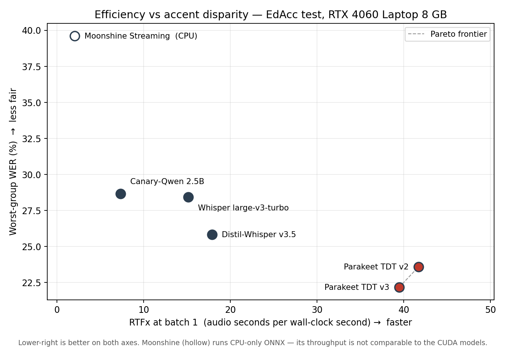

# Results — accent-fairness audit of the 2026 ASR generation

Benchmark: **EdAcc** test split (`edinburghcstr/edacc`, revision `d9ae7bd344f0`), 5,087 scored
utterances across 7 accent groups meeting the inclusion rule (≥20 min audio, ≥3 speakers).
Methodology frozen in [`EVAL_SPEC.md`](EVAL_SPEC.md) v1.0 before any model produced a number;
all deviations are changelogged there with dates. Model checkpoints and dataset revisions
pinned in [`pins.json`](pins.json). Normalizer vendored from `openai/whisper@5f86d1d8`.

Decoding: greedy/model-default, batch size 1, each model's documented default precision.
Every number below is reproducible from the committed `results/<model>/transcripts.jsonl`.

---

## 1. Headline table

Per-group WER (%), lower is better. Sorted by mean WER.

| Model | Params | Indian | Irish | Jamaican | US | Nigerian | Spanish | Vietnamese | **mean** | **worst** | **gap** |
|---|---|---|---|---|---|---|---|---|---|---|---|
| Parakeet TDT v3 | 0.6B | 8.5 | 10.4 | 18.8 | 12.9 | 17.3 | 16.6 | 22.2 | **15.2** | 22.2 | 13.6 |
| Parakeet TDT v2 | 0.6B | 9.6 | 11.1 | 19.5 | 14.7 | 19.0 | 18.0 | 23.6 | **16.6** | 23.6 | 14.0 |
| Distil-Whisper v3.5 | 756M | 10.5 | 12.1 | 23.2 | 16.8 | 20.6 | 20.4 | 25.8 | **18.5** | 25.8 | 15.3 |
| Whisper large-v3-turbo | 809M | 10.5 | 11.5 | 22.7 | 17.3 | 22.5 | 25.7 | 28.4 | **19.9** | 28.4 | 17.9 |
| Canary-Qwen | 2.5B | 20.5 | 15.1 | 28.7 | 23.2 | 20.9 | 17.8 | 24.5 | **21.3** | 28.7 | 13.5 |
| Moonshine Streaming ᴺᴰ | 245M | 16.5 | 18.0 | 34.7 | 23.5 | 30.2 | 26.2 | 39.6 | **26.8** | 39.6 | 23.1 |
| Whisper-small † | 244M | 34.2 | 40.0 | 87.9 | 98.2 | 82.0 | 104.6 | 102.9 | **80.3** | 104.6 | 70.4 |

ᴺᴰ Non-deterministic: fails the §4.5 determinism gate. Measured band at n=300: 10.0% utterance
disagreement between identical passes, |ΔWER| **±0.21 points** overall (worst audited group
±1.02, Irish). The band is ~1–2% of the disparities being measured, so results are reportable
with the band attached.

† Whisper-small is the fine-tuning base for Part 3, not a deployment candidate. Its >100% group
WERs (hallucination loops inflate insertions) make its CIs uninterpretable; it is excluded from
all statistical comparisons.

**Group sizes** (test split, after cleaning): Nigerian 1,351 utt / 5 spk · US 875 / 9 ·
Spanish 852 / 5 · Indian 627 / 3 · Vietnamese 577 / 6 · Jamaican 455 / 4 · Irish 350 / 3.

---

## 2. What the statistics support

Paired speaker-level bootstrap (1,000 resamples, seed 3407), Bonferroni-corrected across 15
comparisons (α = 0.0033, 99.67% CIs). Whisper-small excluded. Full output in
`results/comparisons_*.json`.

### Primary: each model vs the incumbent, Whisper large-v3-turbo

| Model | Δ gap | Δ worst-group | Verdict |
|---|---|---|---|
| Parakeet TDT v2 | −3.9 [−8.5, −1.8] ✓ | −4.8 [−9.1, −2.9] ✓ | **significantly fairer** |
| Parakeet TDT v3 | −4.3 [−9.5, −1.6] ✓ | −6.3 [−10.5, −3.9] ✓ | **significantly fairer** |
| Moonshine Streaming | +5.2 [−4.5, +15.0] | +11.2 [+2.9, +19.5] ✓ | **significantly less fair** (worst-group) |
| Distil-Whisper v3.5 | −2.6 [−7.7, +2.1] | −2.6 [−7.3, +2.4] | indistinguishable |
| Canary-Qwen 2.5B | −4.4 [−15.6, +14.1] | +0.2 [−7.5, +21.3] | indistinguishable |

### Other supported differences (exploratory, same correction)

- Moonshine is significantly worse than **both Parakeets** on gap (+9.1, +9.4) and worst-group
  (+16.0, +17.4), and worse than Distil-Whisper on worst-group (+13.8).
- Distil-Whisper is significantly worse than both Parakeets on worst-group (+2.2, +3.7).
- Canary-Qwen is significantly worse than Parakeet v3 on worst-group (+6.5).
- Parakeet v3 vs v2 on worst-group: +1.4 [+0.0, +3.5] — **borderline**, CI lower bound touches
  zero. Treated as suggestive, not established.

---

## 3. Findings

**1. Efficiency does not systematically cost accent fairness — but edge optimization does.**
The two fastest models audited (Parakeet TDT 0.6B, v2 and v3 — 39–42× real time, 2.6× the
incumbent's throughput at a third of its p95 latency under load, §4) are simultaneously the most
accurate *and* significantly fairer than the 809M incumbent. They are the entire Pareto frontier:
every other CUDA model is strictly dominated on both throughput and worst-group WER. The prediction that the field's
move toward faster models carries a hidden fairness cost is **not supported as a general
claim**. It is supported for one model: Moonshine Streaming, the most aggressively
edge-optimized system tested, is significantly less fair than every other usable model.
The cost attaches to streaming/edge design, not to efficiency as a category.

**2. Open ASR Leaderboard rank does not transfer to accented conversational speech.**
Canary-Qwen 2.5B leads the Open ASR Leaderboard (~5.6% WER) while Parakeet TDT ranks far below
it. On EdAcc that inverts: Parakeet v3 reaches 15.2% mean WER against Canary-Qwen's 21.3% —
a 0.6B model beating a 2.5B leaderboard leader by 6 points on accented English. Canary-Qwen is
5th of 7 here. Leaderboard position is not evidence of accent robustness.

**3. Canary-Qwen has a structurally different error profile.** It is the only model whose worst
group is Jamaican rather than Vietnamese English, and the only one worse on Indian English
(20.5%) than on Spanish (17.8%) — the reverse of every other model. Its worst/best ratio (1.90)
is the flattest measured, but achieved by being uniformly mediocre rather than uniformly strong.

**4. Distillation did not cost accent robustness.** Distil-Whisper v3.5 is *better* than
Whisper large-v3-turbo on mean WER (18.5 vs 19.9) and both disparity metrics, though the
disparity differences are not statistically supported. The published concern that distilled
models underperform on underrepresented accents is not reproduced here.

**5. The multilingual upgrade did not cost English accent robustness.** Parakeet v3
(25 languages) matches or beats v2 (English-only) on every group and both disparity metrics.

**6. Hallucination loops are architectural.** Runaway repetition — hypotheses exceeding
5× the reference length — occurred 401 times for Whisper-small, 13 for Distil-Whisper, 6 for
turbo, and **0** for both Parakeets and Canary-Qwen. RNN-T transducers and the SALM decoder do
not exhibit the failure mode. Moonshine's count of 1 is not comparable: its runtime applies a
`max_tokens_per_second` truncation heuristic that suppresses loops at the library level.

**7. Every model ranks the accent groups near-identically** (Indian/Irish best, Vietnamese
worst for 5 of 7). The disparity is a property of the speech, not of any one architecture.

---

## 4. Efficiency

RTX 4060 Laptop 8 GB, 83 W cap, AC power, idle machine. 120-clip EdAcc sample (11.8 min of
audio, seed 3407), 5-minute warmup at load before any timing. **Service model: one model
instance serving one request at a time** — every backend serializes its model call, so
concurrency is offered load and the latency figures are queueing latencies (EVAL_SPEC §4.2).
Transcripts from these runs are never scored.

| Model | Device | RTFx b1 | RTFx best | Peak VRAM | p50 @1 | p95 @1 | p50 @4 | p95 @4 |
|---|---|---|---|---|---|---|---|---|
| Parakeet TDT v2 | CUDA | **41.7** | 72.1 (b8) | 2.65 GB | 0.157 s | 0.244 s | 0.584 s | 0.717 s |
| Parakeet TDT v3 | CUDA | 39.5 | 66.6 (b8) | 2.71 GB | 0.158 s | 0.248 s | 0.609 s | 0.824 s |
| Distil-Whisper v3.5 | CUDA | 17.9 | 18.6 (b4) | 1.75 GB | 0.288 s | 0.579 s | 1.245 s | 1.982 s |
| Whisper large-v3-turbo | CUDA | 15.1 | 15.5 (b4) | 1.94 GB | 0.342 s | 0.741 s | 1.485 s | 2.324 s |
| Whisper-small † | CUDA | 12.4 | 12.4 (b1) | 0.93 GB | 0.335 s | 0.961 s | 1.602 s | 3.666 s |
| Canary-Qwen 2.5B | CUDA | 7.3 | 7.8 (b8) | 5.18 GB | 0.547 s | 1.850 s | 2.773 s | 5.256 s |
| Moonshine Streaming ᶜᵖᵘ | CPU-ONNX | 2.1 | 2.4 (b16) | — | 1.828 s | 5.920 s | 8.682 s | 15.636 s |

Peak VRAM is `torch.cuda.max_memory_reserved()` at batch 1, before any batched phase can inflate
the high-water mark. Whisper large-v3-turbo and whisper-small both **spill past 7.5 GB at batch
16** — CUDA falls back to system RAM over PCIe and throughput collapses; a real deployment
failure mode on 8 GB, reported rather than hidden. Canary-Qwen is the largest resident model at
5.18 GB and the only one whose batch-16 run fits without spilling.

ᶜᵖᵘ Moonshine's official runtime is CPU-only ONNX, so **its throughput is not comparable to the
CUDA rows** — it is measured on different silicon, not merely a different configuration. Its
runtime also ignores `batch_size` (b1 through b16 span 1.95–2.35, i.e. the same work four times),
which incidentally puts the run-to-run noise floor of the CPU path at roughly ±10%.

† Whisper-small is the fine-tuning base, not a deployment candidate; listed for completeness.

**Thermals.** No model shows measured throttling. Parakeet v2/v3 and Moonshine are *indeterminate*
on every phase, not clean: Parakeet is fast enough that a timing phase lasts 10–18 s (~10 samples
at 1 Hz), too few for a verdict, and the Moonshine run's GPU record describes an idle card because
the work ran on CPU. Supporting evidence that the Parakeet runs were at steady state: 71–80 °C
with sustained power at the 83 W cap and clocks in the same 2.2–2.5 GHz band as the long,
well-sampled Whisper runs. See EVAL_SPEC changelog 2026-08-11.

### The efficiency–disparity frontier



**There is no trade-off to navigate.** The Pareto frontier over (throughput, worst-group WER)
contains only the two Parakeets; every other CUDA model is *strictly dominated* by Parakeet
TDT v3, which is simultaneously 2.2× faster than Distil-Whisper, 2.6× faster than the
incumbent turbo, 5.4× faster than Canary-Qwen — and lower on worst-group WER than all three.
The two Parakeets trade only against each other: v2 is 5.6% faster, v3 is 1.4 points fairer.

This is the sharpest form of Finding 1. The hypothesis motivating the audit — that the field's
move toward faster models carries a hidden accent-fairness cost — predicts an upward-sloping
frontier, where buying speed costs worst-group accuracy. The measured relationship slopes the
other way: across the CUDA models, throughput and fairness improve together. The one model that
does fit the hypothesis, Moonshine Streaming, is both the slowest measured and the least fair,
which is the opposite of a speed-for-fairness trade and instead points at edge/streaming
*architecture* as the cost driver (§3, Finding 1).

Tail behaviour under load reinforces it. At concurrency 4, Parakeet v3's p95 is 0.82 s against
turbo's 2.32 s and Canary-Qwen's 5.26 s — the fairest model is also the one that degrades most
gracefully when queued.

---

## 5. Mitigation — can fine-tuning fix the disparity?

Base: `whisper-small`, full fine-tune. Data: AfriSpeech-200, 5 accent groups meeting the §3
rule in **both** train and test (hausa, igbo, swahili, yoruba, zulu), subsampled to 22.0 h
preserving the natural 11.5× group imbalance (seed 3407, speaker-stratified). Arms: **ERM**
(mean loss) and **Group-DRO** (group-weighted), identical 16,800-step budgets, effective batch
16, lr 1e-5. ERM selected on validation mean WER, DRO on validation worst-group WER, as §6
requires. Test split: 1,889 utterances, 403 speakers — an order of magnitude more speakers per
group than EdAcc offers.

### 5.1 Fine-tuning works, and changes nothing about fairness

Per-group WER (%) on AfriSpeech test, with each group's training hours:

| group | train h | base | ERM | Δ |
|---|---|---|---|---|
| yoruba | 10.1 | 39.3 | 21.4 | **−17.9** |
| igbo | 5.8 | 37.0 | 20.1 | −16.9 |
| hausa | 4.5 | 39.3 | 24.4 | −14.9 |
| swahili | 3.3 | 29.4 | 15.0 | −14.4 |
| zulu | 0.9 | 29.4 | 17.5 | **−11.9** |
| **macro** | | **34.9** | **19.7** | −15.2 |
| **gap** | | **9.89** | **9.34** | −0.55 |

WER falls 43% and the disparity does not move: gap 9.89 → 9.34, worst-group 39.3 → 24.4 while
every other group falls by a similar amount. **The improvement rank-orders perfectly with each
group's training hours** — no inversions across five groups. That is the ERM failure mode stated
quantitatively: it distributes gains in proportion to group data, so a fixed relative disparity
survives a large absolute improvement.

Two things worth noting. Fine-tuning eliminated hallucination loops entirely (4 → 0). And **the
worst group is not the smallest**: Zulu, with 11× less data than Yoruba, is *better* than it both
before and after. Group difficulty here is inherited from pretraining, not created by the data
budget — consistent with §3's Finding 7 that the disparity is a property of the speech.

### 5.2 Group-DRO: no detectable effect

Swept over τ ∈ {1.0, 0.5, 0.25}, weight-tilt ratios 1.5×–5×, identical budgets. Selected pair:
τ=0.5 / step4200. Paired speaker-level bootstrap against ERM on identical utterances (403
speakers, 1,000 resamples, seed 3407, 99.67% CIs):

| metric | ERM | DRO | Δ | 99.67% CI | verdict |
|---|---|---|---|---|---|
| worst-group WER | 24.39 | 23.96 | −0.43 | [−1.69, +3.48] | indistinguishable |
| max−min gap | 9.34 | 8.66 | −0.69 | [−2.30, +3.21] | indistinguishable |
| macro WER | 19.70 | 20.03 | +0.33 | [−0.41, +1.16] | indistinguishable |

Point estimates lean DRO's way on both disparity metrics, but every interval spans zero.
Corroborating that this is a null rather than an underpowered win: **validation worst-group WER
is flat across the sweep** (24.30 / 24.39 / 25.08 for τ = 0.5 / 0.25 / 1.0) despite the tilt
strength varying more than threefold — no dose-response. The comparison is paired because both
arms transcribe the same utterances; the unpaired per-arm intervals overlap almost entirely and
would be the wrong test.

**Power bound, stated rather than buried**: the CI half-width is ~2.5 points, so effects larger
than about 2 points are excluded and smaller ones are not. The claim is *no detectable effect at
this sample size*, not *Group-DRO does not work*.

### 5.3 Getting Group-DRO to optimise what it claims to

Three separate implementation faults were found by inspecting what the group weights actually
did, each of which would have produced a plausible-looking null (EVAL_SPEC changelog 2026-08-12):

1. **Frequency capture.** The textbook update `q_g ← q_g·exp(η·L_g)` touches only groups present
   in the batch — fine under group-balanced sampling, wrong under natural sampling. Yoruba (46%
   of utterances) collected a boost nearly every step while Zulu (4%) was shrunk by
   renormalisation in its absence. Result: q(yoruba) = 0.87, Zulu at the floor — DRO chasing the
   *largest* group rather than the hardest.
2. **Cumulative collapse.** Exponentiated gradient weights by the running *product* of past
   losses, so concentration grows with the training horizon. At η=0.01 — the smallest value §6
   specified — an EMA loss spread of 0.38 nats drove q(hausa) to 0.87 by step 1,450 of 16,800,
   with every snapshot post-collapse.
3. **Scale annihilation.** A stationary softmax over *absolute* loss goes uniform as training
   converges: the weight ratio fell 2.79× → 1.18× between steps 700 and 6,300 while the
   *relative* gap it should act on was undiminished. From ~step 3,000 that arm simply was ERM.

The final form — a softmax over each group's EMA loss **relative to the current mean**, floored
at 1e-3 — is stationary, scale-invariant and self-correcting. It departs from the online rule §6
originally specified; a reader who considers the textbook form the object of study should read
the null accordingly.

### 5.4 The fix does not transfer — it makes things worse

Both fine-tuned models, evaluated on EdAcc through the identical Part 1 pipeline:

| metric | whisper-small base | ERM-ft | DRO-ft |
|---|---|---|---|
| macro WER | 78.5 | 118.9 | 124.6 |
| worst-group WER | 104.6 | 148.8 | 172.7 |
| max−min gap | 70.4 | 89.0 | **117.3** |
| hallucination loops | 401 | 558 | 589 |

**All seven EdAcc groups got worse, and the gap widened by two-thirds.** The DRO arm — the one
selected for fairness — transferred worse than ERM on every metric.

The likely mechanism is domain specialisation rather than accent specialisation: AfriSpeech is
short read clinical speech (~10.6 s mean), EdAcc is long-form spontaneous conversation, and the
loop count rising 401 → 589 is what a model that has lost long-form decoding looks like. Domain,
utterance length and accent all shift together here, so this cannot be attributed to accent
overfitting alone.

Two caveats bound the claim. `whisper-small` was already degenerate on EdAcc (80.3% micro, 401
loops), so this is degradation of a poor model rather than of a deployment candidate — it is the
fine-tuning base by design, not a system anyone would ship. And one base model on one corpus pair
cannot establish that fairness fine-tuning generally fails to transfer.

What it does establish is worth stating plainly: **a mitigation that improved worst-group WER
in-corpus made every accent group worse out-of-corpus, and widened the disparity it was meant to
close.** Cross-corpus evaluation of accent-fairness interventions is rarely reported; on this
evidence it should be.

---

## 6. Methodological finding

**Max−min gap, the metric the accent-bias literature reports by default, is the statistically
weakest disparity metric available.** On identical data under identical correction:

| Metric | Pairwise comparisons reaching significance |
|---|---|
| max−min gap | **4 / 15** |
| worst-group WER | **10 / 15** |

The gap is a difference of two independently noisy per-group estimates and carries roughly
double the variance of a single level. Recommendation: report **worst-group WER as the primary
disparity metric**, with the gap secondary. This harness reports both by default.

---

## 7. Limitations

- **Speaker counts are small.** Indian and Irish English have 3 speakers each, Jamaican 4.
  Per-group WER partly reflects those individuals, not the accent. This is a property of
  EdAcc's speaker-disjoint test split and is why bootstrap resampling is over *speakers*.
  It is the main reason Canary-Qwen is statistically indistinguishable from most models.
- **Southern British English is absent** from the audit — only 18.2 min / 2 speakers in the
  test split, below the inclusion threshold. 17 accent groups were pooled and excluded.
- **Cleaning is not random with respect to accent.** Utterances marked
  `IGNORE_TIME_SEGMENT_IN_SCORING` or containing `<FOREIGN>` are dropped; the highest exclusion
  rate is Spanish at 3.1% (22 of 27 exclusions are code-switching), all others below 1.4%.
- **Long-audio handling differs by backend.** NeMo models chunk utterances above 120 s
  (16 of 9,177; conformer attention memory is O(T²) and a 536 s utterance faults an 8 GB GPU),
  while Whisper models used native sequential long-form decoding with full context. NeMo models
  are mildly disadvantaged on 0.17% of data.
- **Moonshine's runtime differs from the others' in two ways** beyond precision: VAD
  re-segmentation, and the loop-truncation heuristic noted above. Both are its documented
  defaults, but its loop count and, to a lesser degree, its WER reflect library policy as well
  as model behaviour.
- **Training-data contamination is unknown.** Neither NVIDIA nor OpenAI fully discloses training
  corpora, so EdAcc overlap cannot be ruled out. Contamination would *shrink* measured
  disparities, making these figures a lower bound.
- **Worst/best ratio is post-hoc.** It was computed after seeing results and is exploratory,
  not pre-registered. It is not used for any statistical claim.
- **Efficiency is measured under one service model, on one machine.** Latency assumes a single
  model instance serving requests serially (§4); a deployment running several replicas, or
  batching aggressively at the server, would see different tail behaviour. All figures come from
  one RTX 4060 Laptop — the *ordering* of models should be stable, the absolute numbers are not
  portable to datacentre hardware.
- **Moonshine's throughput is not comparable to the rest.** Its reportable runtime is CPU-only
  ONNX; the CUDA/CPU boundary, not a configuration choice, separates it from every other row.
  Its position on the frontier plot is therefore indicative only, and no speed claim in §4 rests
  on it.
- **Thermal steady state is unverified for the fastest models.** Parakeet's timing phases are
  too short (10–18 s) to render a throttling verdict, and the CPU-only Moonshine run has no CPU
  thermal record at all. Temperature, power and clock-band evidence is consistent with steady
  state, but the protocol's own check is indeterminate there (EVAL_SPEC §4.2).
- **Efficiency and accuracy were measured in separate runs**, as the spec requires, so the
  throughput figures come from a 120-clip sample rather than the full 5,087-utterance test set.

---

## 8. Reproducing

```bash
pip install -e ".[dev]"
python pin.py                          # resolve checkpoint + dataset revisions
python scripts/vendor_normalizer.py    # freeze the text normalizer
python scripts/make_groups.py          # freeze accent groups from the pinned split
python scripts/run_audit.py --model parakeet-tdt-0.6b-v3
python scripts/verify_determinism.py parakeet-tdt-0.6b-v3
python scripts/compare_models.py --bonferroni --metric worst_group_wer
python scripts/verify_scoring_consistency.py   # re-score all models in one interpreter
```

The audit ran across two environments (NeMo under WSL2, HF on Windows) carrying different major
versions of jiwer. `verify_scoring_consistency.py` re-scores every model from the committed
transcripts in a single interpreter; all 7 reproduce exactly (max |Δ| = 0), so the per-group
WERs in §1 are mutually comparable.

NeMo models (Parakeet, Canary-Qwen) require Linux or WSL2: `pip install "nemo_toolkit[asr]"`.
Moonshine uses the official ONNX runtime: `pip install moonshine-voice`.

Hardware for all runs: RTX 4060 Laptop (8 GB), 83 W power cap, AC power.
